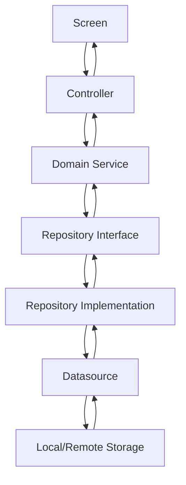

# Feature-First Architecture Guide

## 🎯 **Conceito**

Feature-First é uma abordagem arquitetural que organiza o código por funcionalidades em vez de camadas tradicionais. Cada feature é autocontida com seus próprios entities, services, repositories e UI components.

## 🏗️ **Estrutura de uma Feature**

```
features/
└── example_feature/
    ├── domain/              # Lógica de negócio
    │   ├── entities/        # Entidades de domínio
    │   │   └── user.dart
    │   ├── services/        # Serviços de domínio
    │   │   └── user_service.dart
    │   └── repositories/    # Interfaces de dados
    │       └── user_repository.dart
    ├── data/                # Implementação de dados
    │   ├── repositories/    # Repositories concretos
    │   │   └── user_repository_impl.dart
    │   └── datasources/     # Fontes de dados
    │       ├── local_user_datasource.dart
    │       └── remote_user_datasource.dart
    └── presentation/        # Camada de apresentação
        ├── controllers/     # State management
        │   └── user_controller.dart
        ├── widgets/         # Componentes reutilizáveis da feature
        │   ├── user_card.dart
        │   └── user_form.dart
        └── screens/         # Telas completas
            ├── user_list_screen.dart
            └── user_detail_screen.dart
```

## 🔄 **Fluxo de Dados Interno**



## 📋 **Regras e Convenções**

### **1. Nomenclatura**
- **Entities**: Nomes no singular, PascalCase (`User`, `Product`)
- **Services**: `[Feature]Service` (`UserService`, `OrderService`)
- **Repositories**: `[Feature]Repository` (`UserRepository`)
- **Controllers**: `[Feature]Controller` (`UserController`)

### **2. Organização de Arquivos**
- Cada arquivo deve ter apenas uma classe/interface
- Use barrel exports para simplificar imports
- Mantenha ordem alfabética dentro de diretórios

### **3. Dependencies**
- Domain layer não depende de ninguém
- Data layer depende apenas de domain
- Presentation layer depende de domain e data
- Nunca dependa de camadas inferiores

## 🚀 **Criando Nova Feature**

### **Step 1: Estrutura Base**
```bash
mkdir -p features/new_feature/{domain/{entities,services,repositories},data/{repositories,datasources},presentation/{controllers,widgets,screens}}
```

### **Step 2: Domain Layer**
```dart
// domain/entities/user.dart
class User {
  final String id;
  final String name;
  final String email;
  
  const User({required this.id, required this.name, required this.email});
}

// domain/repositories/user_repository.dart
abstract class UserRepository {
  Future<User> getById(String id);
  Future<List<User>> getAll();
  Future<void> save(User user);
  Future<void> delete(String id);
}

// domain/services/user_service.dart
class UserService {
  final UserRepository _repository;
  
  UserService(this._repository);
  
  Future<User> createUser(String name, String email) async {
    final user = User(id: generateId(), name: name, email: email);
    await _repository.save(user);
    return user;
  }
}
```

### **Step 3: Data Layer**
```dart
// data/repositories/user_repository_impl.dart
class UserRepositoryImpl implements UserRepository {
  final UserDatasource _datasource;
  
  UserRepositoryImpl(this._datasource);
  
  @override
  Future<User> getById(String id) => _datasource.getById(id);
  
  @override
  Future<List<User>> getAll() => _datasource.getAll();
  
  @override
  Future<void> save(User user) => _datasource.save(user);
  
  @override
  Future<void> delete(String id) => _datasource.delete(id);
}

// data/datasources/local_user_datasource.dart
class LocalUserDatasource {
  Future<User> getById(String id) {
    // Implementação local (SharedPreferences, Isar, etc.)
  }
  
  Future<List<User>> getAll() {
    // Implementação local
  }
  
  Future<void> save(User user) {
    // Implementação local
  }
  
  Future<void> delete(String id) {
    // Implementação local
  }
}
```

### **Step 4: Presentation Layer**
```dart
// presentation/controllers/user_controller.dart
class UserController extends ChangeNotifier {
  final UserService _service;
  List<User> _users = [];
  bool _isLoading = false;
  
  List<User> get users => _users;
  bool get isLoading => _isLoading;
  
  UserController(this._service);
  
  Future<void> loadUsers() async {
    _isLoading = true;
    notifyListeners();
    
    _users = await _service.getAllUsers();
    _isLoading = false;
    notifyListeners();
  }
  
  Future<void> createUser(String name, String email) async {
    await _service.createUser(name, email);
    await loadUsers();
  }
}

// presentation/widgets/user_card.dart
class UserCard extends StatelessWidget {
  final User user;
  
  const UserCard({super.key, required this.user});
  
  @override
  Widget build(BuildContext context) {
    return Card(
      child: ListTile(
        title: Text(user.name),
        subtitle: Text(user.email),
      ),
    );
  }
}

// presentation/screens/user_list_screen.dart
class UserListScreen extends StatelessWidget {
  @override
  Widget build(BuildContext context) {
    return ChangeNotifierProvider(
      create: (_) => UserController(getIt<UserService>()),
      child: Consumer<UserController>(
        builder: (context, controller, child) {
          if (controller.isLoading) {
            return const CircularProgressIndicator();
          }
          
          return ListView.builder(
            itemCount: controller.users.length,
            itemBuilder: (context, index) {
              return UserCard(user: controller.users[index]);
            },
          );
        },
      ),
    );
  }
}
```

### **Step 5: Barrel Exports**
```dart
// domain/entities.dart
export 'user.dart';

// domain/services.dart
export 'user_service.dart';

// domain/repositories.dart
export 'user_repository.dart';

// domain.dart
export 'entities.dart';
export 'services.dart';
export 'repositories.dart';

// feature.dart
export 'domain.dart';
export 'data/repositories/user_repository_impl.dart';
export 'presentation/controllers/user_controller.dart';
export 'presentation/widgets/user_card.dart';
export 'presentation/screens/user_list_screen.dart';
```

## 🧪 **Testing Strategy**

### **Unit Tests (Domain)**
```dart
// test/features/user/domain/services/user_service_test.dart
void main() {
  group('UserService', () {
    late UserRepository mockRepository;
    late UserService userService;
    
    setUp(() {
      mockRepository = MockUserRepository();
      userService = UserService(mockRepository);
    });
    
    test('should create user successfully', () async {
      // Arrange
      const name = 'John Doe';
      const email = 'john@example.com';
      
      when(mockRepository.save(any))
          .thenAnswer((_) async {});
      
      // Act
      final result = await userService.createUser(name, email);
      
      // Assert
      expect(result.name, equals(name));
      expect(result.email, equals(email));
      verify(mockRepository.save(any)).called(1);
    });
  });
}
```

### **Widget Tests (Presentation)**
```dart
// test/features/user/presentation/widgets/user_card_test.dart
void main() {
  testWidgets('UserCard displays user information', (tester) async {
    // Arrange
    const user = User(id: '1', name: 'John Doe', email: 'john@example.com');
    
    // Act
    await tester.pumpWidget(
      MaterialApp(
        home: Scaffold(
          body: UserCard(user: user),
        ),
      ),
    );
    
    // Assert
    expect(find.text('John Doe'), findsOneWidget);
    expect(find.text('john@example.com'), findsOneWidget);
  });
}
```

## 📦 **Dependency Injection**

### **Service Registration**
```dart
// app/injection.dart
final getIt = GetIt.instance;

Future<void> initializeDependencies() async {
  // Domain
  getIt.registerLazySingleton<UserRepository>(
    () => UserRepositoryImpl(getIt<LocalUserDatasource>()),
  );
  
  getIt.registerLazySingleton<UserService>(
    () => UserService(getIt<UserRepository>()),
  );
  
  // Data
  getIt.registerLazySingleton<LocalUserDatasource>(
    () => LocalUserDatasource(),
  );
  
  // Presentation
  getIt.registerFactory<UserController>(
    () => UserController(getIt<UserService>()),
  );
}
```

## 🔄 **Best Practices**

### **✅ Do**
- Mantenha features coesas e pequenas
- Use interfaces para desacoplar
- Teste domain layer extensivamente
- Use barrel exports para imports limpos
- Mantenha controllers focados em UI state

### **❌ Don't**
- Misture lógica de negócio com UI
- Crie features muito grandes
- Dependa de camadas inferiores
- Ignore testes
- Use globals para compartilhar estado
- Implemente sistema de XP/pontos (removido do Disciplinum!)

## 🎮 **Exemplo Real: Gamification Feature (Disciplinum)**

### **Estrutura da Feature de Gamificação**
```
features/gamification/
├── domain/
│   ├── entities/
│   │   ├── medal.dart           # Medalhas (Bronze, Prata, Ouro, Diamante)
│   │   ├── insignia.dart        # Insígnias (Madeira → Disciplinum)
│   │   └── module_state.dart    # Estado consolidado do módulo
│   ├── services/
│   │   ├── gamification_award_engine.dart  # Motor de conquistas (sem XP)
│   │   └── streak_service.dart  # Serviço de streaks
│   └── repositories/
│       └── gamification_repository.dart
├── data/
│   ├── repositories/
│   │   └── gamification_repository_impl.dart
│   └── datasources/
│       ├── local_gamification_datasource.dart
│       └── cloud_gamification_datasource.dart
└── presentation/
    ├── controllers/
    │   └── gamification_controller.dart
    └── widgets/
        ├── medal_display.dart
        └── insignia_card.dart
```

### **Entidade de Exemplo (sem XP)**
```dart
// domain/entities/medal.dart
enum GamificationMedal {
  bronze('Bronze', 'assets/medals/bronze.png'),
  silver('Prata', 'assets/medals/silver.png'),
  gold('Ouro', 'assets/medals/gold.png'),
  diamond('Diamante', 'assets/medals/diamond.png');
  
  const GamificationMedal(this.nameBr, this.asset);
  final String nameBr;
  final String asset;
}
```

### **Serviço sem XP**
```dart
// domain/services/gamification_award_engine.dart
class GamificationAwardEngine {
  // Concede medalhas baseadas em streaks (sem cálculos de XP)
  Future<void> checkTimeBasedMedals(NicheId nicheId, GamificationService service);
  
  // Processa eventos sem conceder pontos
  Future<void> processAdultContentEvent(String eventType, AdultContentService service);
  
  // Apenas atualiza estatísticas e concede conquistas reais
  Future<void> _updateAdultContentStats(AdultContentService service, String action);
}
```

## 🗄️ **Banco de Dados em Features (Atualizado)**

### **Entidade Isar (sem XP)**
```dart
// core/database/entities/gamification_progress.dart
@collection
class GamificationProgress {
  Id id = Isar.autoIncrement;
  
  final String userId;
  final int nicheId;
  final int currentStreak;
  final int bestStreak;
  final DateTime lastActivityDate;
  final String? currentMedal;
  final DateTime createdAt;
  final DateTime updatedAt;
  
  // Sem campos de XP!
  // ❌ totalPoints, dailyPoints, currentLevelXP, nextLevelXP
  
  GamificationProgress updateStreak() {
    final now = DateTime.now();
    final newStreak = isStreakBroken ? 1 : currentStreak + 1;
    return copyWith(
      currentStreak: newStreak,
      bestStreak: newStreak > bestStreak ? newStreak : bestStreak,
      lastActivityDate: now,
      updatedAt: now,
    );
  }
  
  // Atualiza medalha em vez de nível
  GamificationProgress updateMedal(String newMedal) {
    return copyWith(
      currentMedal: newMedal,
      updatedAt: DateTime.now(),
    );
  }
}
```

## 🚀 **Feature Communication (Atualizado)**

### **EventBus para Features Desacopladas**
```dart
// domain/events/gamification_events.dart
class MedalAwardedEvent {
  final NicheId nicheId;
  final GamificationMedal medal;
  MedalAwardedEvent(this.nicheId, this.medal);
}

class InsigniaEarnedEvent {
  final NicheId nicheId;
  final FocusInsignia insignia;
  InsigniaEarnedEvent(this.nicheId, this.insignia);
}

// Em uma feature
EventBus.instance.fire(MedalAwardedEvent(nicheId, medal));

// Em outra feature
EventBus.instance.listen<MedalAwardedEvent>((event) {
  LoggerService.instance.i('Medalha conquistada: ${event.medal.nameBr}');
  AnalyticsService.trackMedalAwarded(event.nicheId, event.medal);
});
```

### **Shared Services**
```dart
// shared/services/notification_service.dart
class NotificationService {
  void showMedalNotification(GamificationMedal medal, String moduleName) {
    // Notificação de conquista (sem menção a pontos)
  }
  
  void showInsigniaNotification(FocusInsignia insignia, String moduleName) {
    // Notificação de insígnia
  }
}

// core/services/logger_service.dart
class LoggerService {
  static final LoggerService instance = LoggerService._();
  LoggerService._();
  
  void i(String message, {Object? error, StackTrace? stackTrace}) {
    // Logging estruturado
  }
  
  void gamification(String message) {
    i('[GAMIFICATION] $message');
  }
}
```

## 🎯 **Conclusão**

Feature-First architecture proporciona:

- **Escalabilidade**: Features independentes
- **Manutenibilidade**: Código organizado por funcionalidade
- **Testabilidade**: Isolamento claro entre camadas
- **Colaboração**: Equipes podem trabalhar em features diferentes
- **Gamificação Limpa**: Sistema de conquistas sem complexidade de XP

Esta abordagem é ideal para projetos Flutter que precisam crescer de forma sustentável e manter alta qualidade de código, especialmente com foco em gamificação significativa em vez de sistemas de pontos genéricos.

### **Caso Disciplinum**

O Disciplinum implementa com sucesso esta arquitetura com:
- ✅ Gamificação baseada apenas em medalhas e insígnias
- ✅ Sistema de streaks motivacional
- ✅ EventBus para comunicação desacoplada
- ✅ Logging estruturado e analytics
- ✅ Repository pattern com cache local e sincronização

**Resultado**: Arquitetura enterprise-level sem a complexidade desnecessária de sistemas de XP.
